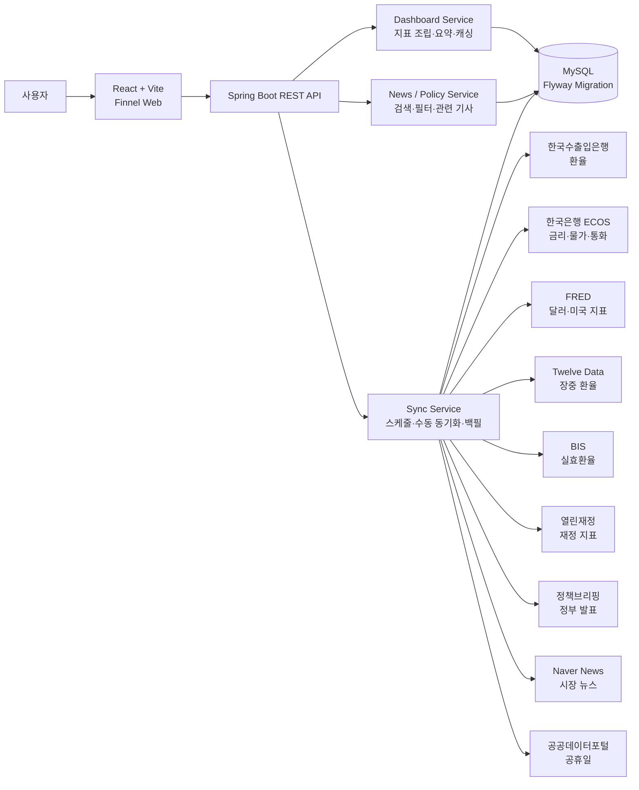
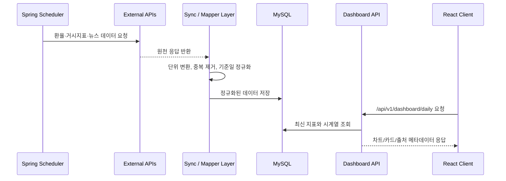

  
  <h1>Finnel</h1>
  
<strong>원/달러 환율과 거시경제 지표, 정책 발표, 시장 뉴스를 한곳에서 추적하는 금융 데이터 대시보드</strong>

  

    
    
    
  

  

    <a href="#-시작-가이드-getting-started--api-docs">Getting Started</a>
    ·
    <a href="#-시스템-아키텍처-system-architecture">Architecture</a>
    ·
    <a href="#-주요-기능-소개">Features</a>
  

---

## 🗓️ 개발 기간

| 구분 | 내용 |
| --- | --- |
| 개발 기간 | 2026.07 - 2026.08 |
| 프로젝트 성격 | 개인 프로젝트, 포트폴리오, 경제 지표 학습 및 환율 변동 관찰용 대시보드 |
| 핵심 목표 | 여러 기관에 흩어진 환율·경제·정책·뉴스 데이터를 하나의 화면 흐름으로 통합 |
| AI 활용 | Codex: 코드 작성 및 리팩터링 / Gemini: 검색 및 기능 방향 검토 |

Finnel은 **Finance + Funnel**의 합성어입니다. 미국 주식 투자자 관점에서 원/달러 환율 변동을 이해하기 위해 환율, 금리, 물가, 달러 인덱스, 정책 발표, 뉴스 흐름을 한곳으로 모으는 데 초점을 맞췄습니다.

## ✨ 주요 기능 소개

### 📊 대시보드

- USD/KRW 환율, 달러 인덱스, 한국·미국 기준금리, 외환보유액 등 핵심 지표를 요약합니다.
- 1일, 3개월, 1년, 5년 범위로 환율 흐름을 전환하며 단기 변동과 중장기 흐름을 함께 확인할 수 있습니다.
- 장중 환율은 라인 차트와 캔들 차트 형태로 비교할 수 있도록 구성했습니다.

### 🇰🇷 경제지표

- 금리, 물가, 통화량, 재정, 외국인 자금 흐름처럼 원화에 영향을 줄 수 있는 국내외 지표를 묶어 제공합니다.
- 지표별 최신값, 이전값 대비 변화, 시계열 히스토리를 함께 보여줍니다.
- 한국은행 ECOS, FRED, 열린재정 등 출처가 다른 데이터를 동일한 대시보드 형식으로 정규화합니다.

### 📰 정책뉴스

- 정부 부처의 공식 발표 중 환율, 금융시장, 물가, 수출입, 재정과 관련된 정책 브리핑을 수집합니다.
- 카테고리, 기간, 키워드 기반으로 필요한 정책 신호를 빠르게 필터링할 수 있습니다.
- 일반 뉴스보다 느리지만 출처가 명확한 정책성 정보를 확인하는 용도입니다.

### 🔎 뉴스검색

- 네이버 뉴스 검색 API를 활용해 환율 관련 시장 뉴스를 탐색합니다.
- 동일한 이슈를 다루는 기사들을 이어서 볼 수 있도록 관련 기사 조회 흐름을 제공합니다.
- 검색어, 기간, 카테고리 필터를 통해 시장이 반응하는 이슈를 빠르게 훑을 수 있습니다.

### 🌐 화폐랭킹

- 주요 통화 대비 원화 움직임과 실효환율 흐름을 비교합니다.
- BIS, FRED, Twelve Data 기반 데이터를 활용해 특정 통화만 보는 한계를 줄였습니다.
- 원화 약세·강세가 글로벌 통화 흐름 안에서 어느 위치인지 확인할 수 있습니다.

### 💱 환전계산

- 원화와 외화 간 금액을 환산하고, 기준 환율 변화에 따른 체감 금액을 계산합니다.
- 투자, 송금, 환전 전 환율 민감도를 빠르게 점검하는 보조 도구입니다.

## ⚙️ 기술 스택 (Tech Stack)

### Client

### Server

### Database & DevOps

### External Data

## 🏗️ 시스템 아키텍처 (System Architecture)

### 주요 데이터 흐름

## 💡 핵심 기술적 의사결정 / 트러블슈팅 요약

| 주제 | 결정 / 해결 |
| --- | --- |
| 데이터 정합성 | 외부 API별 날짜, 단위, 응답 형태가 달라 Sync Layer에서 정규화 후 저장하도록 분리했습니다. |
| DB 스키마 관리 | 운영 데이터 성격이 강한 프로젝트라 Flyway 기반 마이그레이션으로 테이블 변경 이력을 관리했습니다. |
| 조회 성능 | 대시보드 첫 화면은 여러 테이블을 조합하므로 `DailyDashboardCache`로 짧은 TTL 캐시를 적용했습니다. |
| 장중/일별 환율 분리 | 실시간성 데이터와 일별 기준 환율의 의미가 달라 별도 테이블과 매퍼로 분리했습니다. |
| 동기화 안정성 | 스케줄러, 수동 동기화, 백필 작업을 구분하고 실행 상태와 쿨다운을 관리해 중복 실행 위험을 줄였습니다. |
| POST 동기화 보안 | 관리자 토큰과 내부 CIDR 옵션으로 수동 동기화 엔드포인트 접근을 제한했습니다. |
| 영업일 처리 | 공휴일 API와 캐시 테이블을 활용해 환율 백필 기준일을 한국 영업일 기준으로 판단했습니다. |

## 🚀 시작 가이드 (Getting Started / API Docs)

Finnel은 환율 변동을 이해하기 위해 필요한 시장 데이터, 거시경제 지표, 정책 발표, 뉴스를 한 화면 흐름으로 연결하는 서비스입니다. README에서는 서비스 기능과 설계 의도를 중심으로 소개하고, 실행에 필요한 상세 설정은 예시 파일로 분리했습니다.

### 환경 변수 예시

- Backend: [`backend/.env.example`](backend/.env.example)
- Frontend: [`frontend/.env.example`](frontend/.env.example)

### 주요 API 요약

| Method | Endpoint | 설명 |
| --- | --- | --- |
| `GET` | `/api/v1/dashboard/daily` | 대시보드 핵심 지표와 차트 데이터 |
| `GET` | `/api/v1/today-flow` | 오늘의 시장·뉴스·정책 흐름 |
| `GET` | `/api/v1/news` | 환율 관련 뉴스 검색 |
| `GET` | `/api/v1/government-briefings` | 정부 정책 브리핑 검색 |
| `GET` | `/api/v1/sync/*/status` | 데이터 동기화 상태 확인 |

수동 동기화 API는 운영용 관리자 토큰을 전제로 하며, 공개 사용자가 직접 호출하는 기능은 아닙니다.

### 데이터 출처

| 데이터 | 출처 |
| --- | --- |
| 환율과 달러 지표 | 한국수출입은행, FRED, Twelve Data |
| 금리·물가·통화·자금 흐름 | 한국은행 ECOS, FRED |
| 실효환율과 통화 비교 | BIS, FRED |
| 재정 관련 지표 | 열린재정 Open API |
| 정부 발표 | 대한민국 정책브리핑 Open API |
| 뉴스 검색 | 네이버 뉴스 검색 API |
| 영업일·공휴일 처리 | 공공데이터포털 특일 정보 |

---

> API 키와 운영용 토큰은 `.env` 또는 배포 환경 변수로만 관리합니다. 프론트엔드 번들에는 외부 API 키나 동기화 토큰이 포함되지 않아야 합니다.
