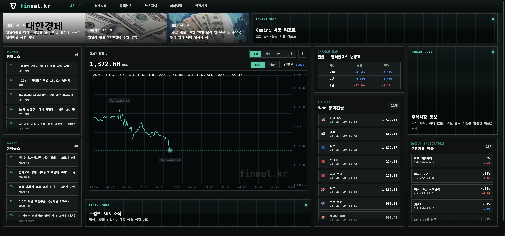
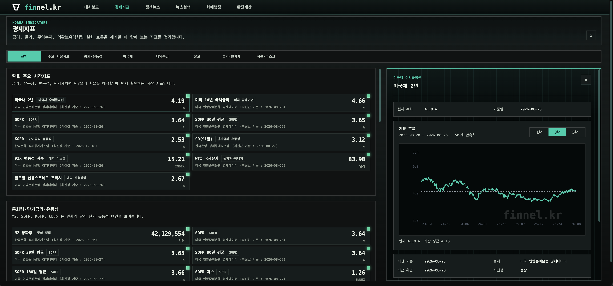
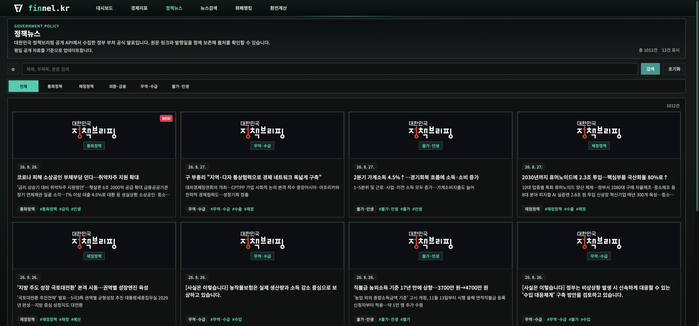
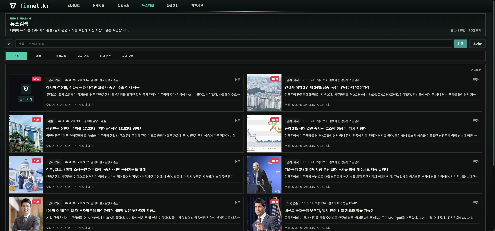
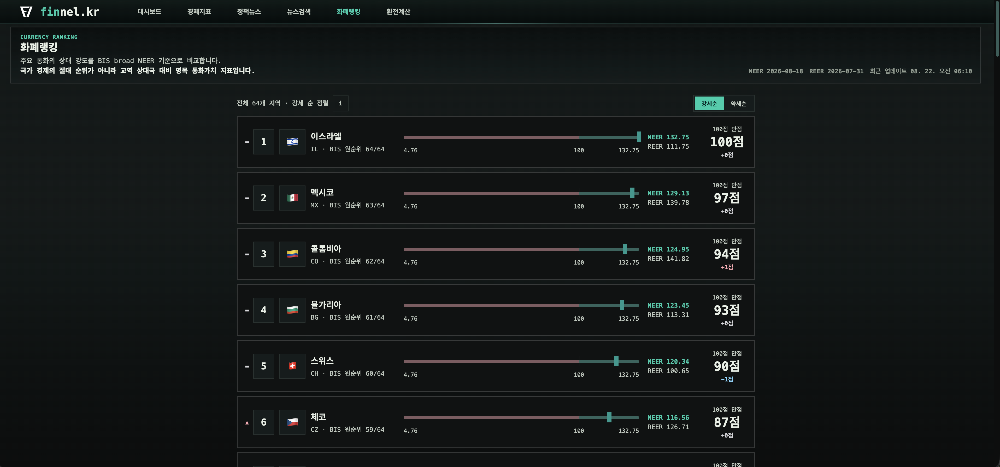
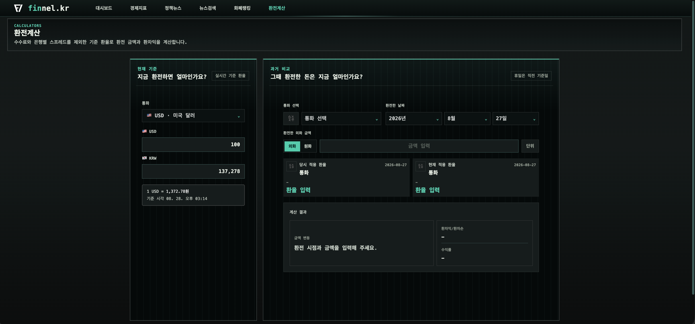

  
  <h1>Finnel</h1>
  
<strong>KRW & Macro Dashboard for Exchange Rate-Aware Investors</strong>

  

    Exchange Rates ·
    Macro Indicators ·
    Policy Briefings ·
    Market News ·
    Currency Ranking
  

## Finnel

Finnel은 개인 학습과 관찰을 위해 만든 대시보드 프로젝트입니다. 미국 주식 투자자 입장에서 환율 변동에 민감했고, 관련 공부를 하다 보니 경제 지표와 뉴스, 정부 발표를 자주 찾아보게 되었습니다.

흩어진 정보를 매번 따로 찾아보는 과정이 불편해서, 환율 변동과 관련된 자료를 한곳에서 볼 수 있는 웹으로 만들었습니다. 복잡한 경제 흐름을 조금 더 차분하게 따라가는 것을 목표로 했습니다.

| 구분 | 내용 |
| --- | --- |
| 성격 | 개인 프로젝트, 경제 지표 학습 및 환율 변동 관찰용 대시보드 |
| 진행 기간 | 2026.07 - 2026.08 |
| Frontend | React, Vite, TypeScript, Recharts, Tailwind CSS |
| Backend | Spring Boot, Java 17, MySQL, Flyway |
| AI 활용 | Codex: 코드 작성·리팩터링 / Gemini: 검색·기능 방향 의사결정 |

## 화면

### 대시보드

USD/KRW 환율 흐름과 주요 거시 지표를 함께 보는 첫 화면입니다. 단기 환율 변동과 중장기 흐름을 같이 확인할 수 있도록 구성했습니다.

### 경제지표

금리, 물가, 통화량, 재정, 외국인 자금 흐름처럼 원화에 영향을 줄 수 있는 국내외 지표를 묶어 봅니다. 각 지표는 최신값만 보지 않고 과거 흐름과 함께 확인하는 것을 기준으로 만들었습니다.

### 정책뉴스

정부 부처의 공식 발표 중 환율, 금융시장, 물가, 수출입, 재정과 관련된 내용을 모아 보는 탭입니다. 뉴스보다 느리지만 출처가 명확한 정책 신호를 확인하는 용도입니다.

### 뉴스검색

환율과 관련된 최신 뉴스를 검색하고, 같은 이슈를 다루는 기사들을 이어서 볼 수 있도록 만든 탭입니다. 시장이 어떤 이야기에 반응하고 있는지 빠르게 훑는 데 사용했습니다.

### 화폐랭킹

원화의 움직임이 다른 통화와 비교해 어떤 위치에 있는지 보기 위한 화면입니다. 주요 통화의 상대적 움직임과 실효환율 흐름을 함께 봅니다.

### 환전계산

원화와 외화를 바꿔 계산하고, 과거 환율 기준으로 같은 금액이 어떻게 달라졌는지 확인하는 도구입니다. 투자나 송금 전에 환율 민감도를 감으로 보기 위해 넣었습니다.

## 데이터 출처

| 기능 | 주요 출처 |
| --- | --- |
| 환율과 달러 지표 | 한국수출입은행, FRED, Twelve Data |
| 금리·물가·통화·자금 흐름 | 한국은행 ECOS, FRED |
| 실효환율과 통화 비교 | BIS, FRED |
| 재정 관련 지표 | 열린재정 Open API |
| 정부 발표 | 대한민국 정책브리핑 Open API |
| 뉴스 검색 | 네이버 뉴스 검색 API |
| 영업일·공휴일 처리 | 공공데이터포털 특일 정보 |

## 추후 추가 기능

- 트럼프 SNS 연동: 주요 발언이 환율과 시장 분위기에 미치는 영향을 함께 확인할 수 있도록 연동
- Gemini 리포트: 수집된 지표와 뉴스를 바탕으로 일별 요약 리포트 생성
- 주식시장 데이터 제공: 미국 주식 투자자가 함께 참고할 수 있는 주요 지수와 시장 데이터 추가

## 메모

API 키와 운영용 토큰은 `.env` 또는 배포 환경 변수로만 관리합니다. 프론트엔드 번들에는 외부 API 키나 동기화 토큰이 포함되지 않아야 합니다.
